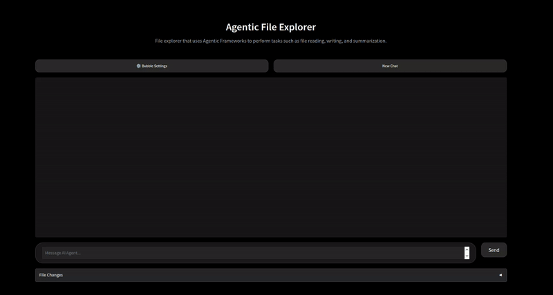

# Agentic File Explorer

A locally-running AI agent that navigates, reads, writes, searches, and reasons over a file system through natural language — built on a **ReAct agent loop**, **hierarchical agent architecture**, **short-term memory**, and **automatic context compaction**.

Structurally similar to document processing pipelines used in production legal and enterprise AI systems — running entirely on-device with no API keys required.

> **Stack:** LangChain · Ollama · Gradio · FastAPI · Python · uv

---

## How It Works

### Agent Loop

The agent runs a [ReAct (Reason + Act) loop](https://docs.langchain.com/oss/python/langchain/agents#example-of-react-loop) — at each turn it reasons about what needs to be done, selects the appropriate tool, observes the result, and decides whether to act again or respond. This lets it handle multi-step tasks like:

> *"Find all CSV files in the project folder, read the one that mentions sales, and summarize the top 3 rows"*

without the user having to decompose the task manually.

Two agent variants are available:

- **`stm_context_agent`** — Full agent with short-term memory, context compaction, and streaming responses. Default mode.
- **`no_context_agent`** — Lightweight stateless agent with no memory. Useful for isolated single-turn tasks.

### Context Management

Running agents on smaller local models introduces a hard constraint: limited context windows. This project addresses that with two mechanisms working in tandem:

**Short-term memory (STM):** Token count is tracked incrementally across turns. When the conversation exceeds `MAX_CONTEXT_WINDOW` (1000 tokens by default), a secondary summarization agent compresses older messages into a compact summary — preserving continuity without truncating history or blowing up the window.

**File references instead of content injection:** Rather than inserting raw file contents into the system prompt, the agent maintains a `FileDictionary` — a lightweight in-memory registry mapping file IDs to metadata (path, size, MIME type). No file content is ever held in memory. The system prompt receives only references; content is read directly from disk each time a tool explicitly requests it.

This prevents context pollution, eliminates cross-turn file confusion, and avoids OOM errors from accumulating file contents in long sessions. It also makes agent behavior more auditable: tool calls are the only path to file data, so you can always see exactly what the agent accessed and when.

*Context management approach informed by the taxonomy in [Context Engineering 2.0](https://arxiv.org/abs/2510.26493) (Hua et al., 2025).*

### Tool Architecture

Tools are organized into a **hierarchical sub-agent architecture**. Rather than exposing all file operations as a flat tool list to the top-level agent, each domain has a dedicated **sub-agent** that is itself wrapped as a single tool. The top-level agent selects from 4 tools; the selected sub-agent handles the specifics internally.

```
hierarchical_agent_tools.py  ← creates sub-agents, exposes them as tools
├── txt_file_agent       ← sub-agent with txt_tools (read / write / append / clear)
├── csv_file_agent       ← sub-agent with csv_tools (read / get headers / write / append)
├── directory_agent      ← sub-agent with directory_tools (list / create)
└── traversal_agent      ← sub-agent with traversal_tools (BFS / DFS)
```

Sub-agents run on a **dedicated model** (`qwen2.5:3b`, thinking disabled) configured independently of the orchestrator in `configs/tool_config.json` under `SUB_AGENT_MODEL`. Swapping the orchestrator model via `--model` does not affect sub-agent speed.

Each sub-agent has its own **narrow system prompt** (`prompts/system_prompts/<agent>_prompt.md`) that:
- Restricts the agent to its own file type (e.g. the txt agent refuses `.csv` requests)
- Defines the exact query format the top-level agent must use
- Enforces **one file per call** — if the top-level agent bundles multiple files into one query, the sub-agent rejects it and instructs the caller to resubmit separately

The top-level agent's base prompt also enforces the same rule: **one tool call per file or operation**. A request involving N files produces N sequential tool calls — never a single batched call.

Every sub-agent invocation is recorded in `logs/audit.log` with a shared request ID so query and response can be correlated:

```
action=sub_agent_query  | req=a3f2c1d0 | agent=txt_file_agent query='read cosmic.txt'
action=sub_agent_response | req=a3f2c1d0 | agent=txt_file_agent response='galactus is...'
```

Rollback is intentionally excluded from the agent's tool surface — it is user-controlled only (see [UI](#gradio-ui)).

Each domain also has a separate **functions layer** (pure logic) and a **tools layer** (LangChain wrappers) — keeping the agent core decoupled from file I/O implementation. Adding support for a new file type means adding one functions file, one tools file, one sub-agent prompt, and one sub-agent entry; the top-level agent is untouched.

### Search Strategies

The agent selects between two traversal strategies depending on the task:

- **BFS (Breadth-First Search):** Best for finding files near the top of a directory tree
- **DFS (Depth-First Search):** Best for locating deeply nested files

Both support exact and approximate (fuzzy) matching using a 0.8 similarity threshold via `SequenceMatcher`.

---

## Design Decisions

**Why Qwen3:4b with thinking disabled?** Benchmarking the same task across configurations:

| Config | Generation | Tokens | Total time |
|--------|-----------|--------|------------|
| qwen3:8b Q4_K_M (thinking on) | 8.52 tok/s | 10,673 | 2m 6s |
| qwen3:8b Q4_K_M (thinking off) | 10.40 tok/s | 392 | 1m 13s |
| qwen3:4b Q4_K_M (thinking on) | 34.15 tok/s | 4,573 | 2m 21s |
| qwen3:4b Q4_K_M (thinking off) | 37.32 tok/s | 335 | **9.8s** |

<details>
<summary>Test environment</summary>

- **GPU:** NVIDIA GeForce RTX 3050 Laptop — 4 GB VRAM
- **Driver:** 560.35.05 · CUDA 12.6
- **OS:** Ubuntu 24.04 LTS (kernel 6.8.0-106-generic)
- **Ollama:** 0.12.5
- **Quant:** Q4_K_M for both models

`qwen3:4b` (≈2.6 GB) fits entirely in VRAM → 100% GPU inference. `qwen3:8b` (≈5.2 GB) exceeds VRAM and spills to CPU, cutting generation speed to ~¼. Run `ollama ps` while the agent is active to see how your hardware handles each model.
</details>

Two independent wins: the 4B model fits fully in VRAM (4× faster token generation), and disabling thinking eliminates chain-of-thought tokens (10× fewer tokens generated). Combined, that's 2 minutes → under 10 seconds on the same task.

`qwen3:4b` is the default and the recommended starting point — if you find a larger model gives meaningfully better results on your tasks, use it via `--model`. Tool-selection accuracy still benefits more from instruction-following quality than raw parameter count.

**Why local / Ollama?** Zero API costs, no data leaving the machine, and the freedom to swap models freely via `--model`. The context management work was motivated directly by the constraints of running 8B models — those constraints don't disappear at larger scales, they just shift.

**Why hierarchical sub-agents?** A flat tool list causes the model to select incorrectly as tool count grows. Wrapping each domain as a sub-agent reduces the top-level agent's tool surface to a small set of choices — one per domain — and keeps sub-agent tool calls internal, so they never pollute the main context window. If the agent misuses a file operation, you know exactly which sub-agent to inspect.

**Why narrow system prompts per sub-agent?** Without guidance, a sub-agent receiving "read cosmic.txt and comic.txt" may read one file and hallucinate the other. Each sub-agent now has a focused system prompt that defines acceptable inputs, the expected query format, and a hard one-file-per-call rule. If the sub-agent receives a multi-file query it tells the top-level agent to resubmit — turning a silent hallucination into an explicit, recoverable failure.

**Why git-backed rollback?** File write and append operations are destructive and irreversible by default. Rather than storing in-memory snapshots (lost on restart) or blocking the agent on each commit, `data/` maintains its own isolated git repository. A background thread commits every file mutation asynchronously — the agent returns its response immediately while the commit races ahead in the background. By the time the user reads the output and sends the next message, the commit is done. Rollback calls `git revert` (last change) or `git reset --hard` (all changes), keeping the agent in full control of its own history without touching the project repository.

**Why file references?** Early testing showed that injecting raw file contents into the system prompt caused the model to hallucinate edits and confuse files across turns. Beyond that, accumulating file contents in memory across a long session is an OOM risk — especially with larger files. The `File` model stores only metadata (path, size, MIME type); `get_content()` reads from disk on demand. Replacing contents with lightweight references keeps both context and memory lean, and forces tool calls to be the only path to file data — making agent behavior more predictable and auditable. Approach informed by [Context Engineering 2.0](https://arxiv.org/abs/2510.26493) (Hua et al., 2025).

**Why BFS and DFS as separate tools?** Giving the agent both strategies and letting it choose based on task context — rather than always running one — improves search efficiency and mirrors how a human would approach the problem. Shallow search for obvious files, deep search when you expect nesting.

**Why SSE for remote mode?** The agent's `stream()` is already a generator that yields tokens one at a time — Server-Sent Events maps directly onto that with almost no adaptation. The client receives a readable token stream and file contents are never serialized into any response body. A background git-commit thread per directory prevents lock-file races when multiple operations target the same repo concurrently.

---

## Quick Start

**1. Install [Ollama](https://ollama.com/download/linux) and pull the recommended model:**

```bash
ollama pull qwen3:4b
ollama pull qwen2.5:3b
```

**2. Install the [uv](https://docs.astral.sh/uv/) package manager:**

```bash
curl -LsSf https://astral.sh/uv/install.sh | sh
```

**3. Install dependencies:**

```bash
uv sync
```

**4. Run** — pick a mode:

```bash
# Gradio web UI (local)
uv run python ui.py

# CLI (local)
uv run python main.py
```



### Gradio UI

Bot responses render as plain markdown — no background bubble — so code blocks, headers, and lists display cleanly. User messages appear in a coloured bubble.

A **⚙️ Bubble Settings** button lets you change the user bubble colour (Gray, Purple, Blue, Emerald, Orange, Pink, Cyan) with a live preview before returning to chat.

The web UI also adds a **File Changes** panel (collapsible accordion) below the chat:

- **Commits dropdown** — lists the last 10 commits from `data/`'s git history. Click **Load More** to page through older commits in batches of 10.
- **Changed files dropdown** — appears when a commit is selected; shows only the files touched by that commit.
- **Diff viewer** — appears when a file is selected; renders a color-coded unified diff (green additions, red deletions) directly in the browser with no external dependencies.
- **↩ Rollback Last** — reverts the most recent commit and injects a `[File system]` notice into the chat and agent context.
- **⏮ Rollback All** — resets `data/` to its initial state and notifies the agent.

> **Note:** The UI is designed for single-user local use. Multi-user session isolation (per-session `data/` directories) is future work.

---

## Remote Mode

The agent can run on a separate server while the UI or CLI runs on any machine. **Only AI response tokens cross the wire — file contents never leave the server.**

### Running the server

```bash
# On the machine where the files live (Ollama must be running here)
uv run uvicorn server:app --host 0.0.0.0 --port 8000
```

### Connecting a client

```bash
# Gradio UI — remote
REMOTE_MODE=1 AGENT_SERVER_URL=http://<server-ip>:8000 uv run python ui.py

# CLI — remote
REMOTE_MODE=1 AGENT_SERVER_URL=http://<server-ip>:8000 uv run python main.py
```

`AGENT_SERVER_URL` defaults to `http://localhost:8000`, so for local testing you can omit it:

```bash
# Terminal 1
uv run uvicorn server:app --port 8000

# Terminal 2
REMOTE_MODE=1 uv run python ui.py
```

In remote CLI mode, type `/new` or `/reset` to start a fresh session.

### MCP server

Exposes all file-exploration tools (read, write, search, directory operations) as [Model Context Protocol](https://modelcontextprotocol.io) tools so any MCP-compatible client (Claude Desktop, etc.) can use them directly.

```bash
# Dev mode with inspector
uv run mcp dev mcp_server.py

# Install into Claude Desktop
uv run mcp install mcp_server.py --name "agentic-file-explorer"
```

### Architecture

```
CLIENT (ui.py / main.py)              SERVER (server.py)
sends: { message }              →     FastAPI  POST /chat  (SSE stream)
receives: token stream only     ←     agent + Ollama (on-machine)
                                       data/ git repo
```

| Endpoint | Description |
|----------|-------------|
| `POST /chat` | Stream agent response as SSE. Accepts `{ "message": "..." }`. |
| `POST /new-chat` | Reset the session (clear short-term memory). |
| `POST /inject` | Inject a notice into the agent's context (used by rollback). |

Every request to the server is recorded in `logs/audit.log` with a timestamp, the endpoint called, the caller's IP, and the full message or notice content. Sub-agent queries and responses are also written to `audit.log` with a shared request ID (`req=`) so each query/response pair can be correlated.

---

## Available Tools

| Tool | Description | Formats |
|------|-------------|---------|
| **Read** | Read file contents. For CSVs, optionally limit to the first or last N rows and/or filter to specific columns. | `.txt`, `.csv` |
| **Get Headers** | Return the column headers of a CSV file. Useful for verifying exact column names before reading or writing. | `.csv` |
| **Write** | Write or overwrite a file | `.txt`, `.csv` |
| **Append** | Append content to a new line | `.txt`, `.csv` |
| **Clear** | Clear file contents (disabled by default) | `.txt`, `.csv` |
| **List Directory** | Display files and subdirectories | All |
| **Create Directory** | Create new directories | — |
| **BFS Search** | Breadth-first file system search | Files & dirs |
| **DFS Search** | Depth-first file system search | Files & dirs |
All operations are sandboxed within the `data/` directory. The `clear` tool is disabled by default and must be enabled with `--allow-clear-txt true` (CLI) or by setting `allow_clear_txt.default` to `true` in `configs/ui_configs.json` (UI).

Rollback operations (undo last change, undo all changes, view history) are available in the Gradio UI's **File Changes** panel and are not exposed to the agent as tools.

Every write, append, and clear operation is automatically committed to a git repository inside `data/` via a background thread, enabling full rollback without blocking the agent.

---

## Configuration

| Flag | Default | Description |
|------|---------|-------------|
| `--model` | `qwen3:4b` | LLM model to use via Ollama |
| `--think` | `false` | Enable extended thinking for the orchestrator model |
| `--verbose` | `false` | Enable conversation logging (`logs/agentic-sum.log` for CLI, `logs/agentic-ui.log` for UI) |
| `--username` | `user` | Display name in the UI |
| `--temperature` | `0` | Model temperature (0 = deterministic) |
| `--stm` | `true` | Enable short-term memory and context compaction |
| `--allow-clear-txt` | `false` | Enable the `clear_txt` tool (permanently erases file contents) |

> **Note:** Boolean flags require an explicit value: `--verbose true`, `--stm false`.

```bash
# Use a different model
uv run main.py --model qwen3:8b

# Enable thinking (slower, more deliberate reasoning)
uv run main.py --think true

# Verbose logging + custom username
uv run main.py --verbose true --username alice

# More creative responses
uv run main.py --temperature 0.7

# Combine flags
uv run main.py --model qwen3:8b --think true --username alice --verbose true
```

### Recommended Models

| Model | Notes |
|-------|-------|
| `qwen3:4b` ✅ | Default orchestrator. Fits fully in VRAM, thinking off |
| `qwen2.5:3b` | Default sub-agent model. Fast tool-calling, lower memory footprint |
| `qwen3:8b` | Higher accuracy on complex tasks; use if 4b misses tool calls |
| `llama3.1` | Strong general performance; also used as default summarization model |
| `phi3.5` | Lightweight alternative for lower-resource machines |

The agent is model-agnostic — any Ollama-compatible model can be swapped in via `--model`.

**Choosing the right model size:** Run `ollama ps` while the agent is active to see how the current model is split across GPU and CPU:

```
NAME            ID      SIZE    PROCESSOR    UNTIL
qwen3:4b        ...     3.0 GB  100% GPU     ...
qwen2.5:3b      ...     2.0 GB  100% GPU     ...
qwen3:8b        ...     6.2 GB  46%/54% CPU  ...
```

If the model is running partly on CPU (`XX% CPU`), generation will be slower. A model that fits entirely in VRAM (`100% GPU`) is significantly faster. Use this to decide whether to step up or down in model size for your hardware.

---

## Project Structure

```
agentic-file-explorer/
├── main.py                   # CLI entry point — local or remote mode via REMOTE_MODE
├── ui.py                     # Gradio web UI — local or remote mode via REMOTE_MODE
├── server.py                 # FastAPI server: SSE /chat, /new-chat, /inject
├── remote_agent.py           # HTTP client mirroring the agent.py interface
├── mcp_server.py             # MCP server exposing file tools to Claude Desktop etc.
├── agent.py                  # Agent wrapper for local UI/server streaming
├── stm_context_agent.py      # Main agent: STM + context compaction + streaming
├── no_context_agent.py       # Lightweight stateless agent (no memory)
│
├── stm.py                    # Short-term memory: token tracking + compaction trigger
├── stm_loader.py             # Summarization agent loader
├── context.py                # Context window management, trimming, token counting
│
├── file.py                   # File model (Pydantic)
├── file_dictionary.py        # In-session file reference registry
│
├── hierarchical_agent_tools.py # Creates domain sub-agents, exposes them as tools
├── traversal_tools.py        # BFS / DFS LangChain tool wrappers
├── traversal_functions.py    # BFS / DFS traversal logic
├── directory_tools.py        # Directory operation tool wrappers
├── directory_functions.py    # Directory operation logic
├── txt_tools.py              # .txt file tool wrappers
├── txt_functions.py          # .txt file I/O logic
├── csv_tools.py              # .csv file tool wrappers
├── csv_functions.py          # .csv file I/O logic
├── rollback.py               # Git-backed rollback: async commits, revert, reset, diff queries
├── rollback_tools.py         # LangChain tool wrappers for rollback operations
│
├── compare.py                # Exact and fuzzy string matching
├── setup_directory.py        # Sandboxed path construction (data_dir param throughout)
├── string_functions.py       # Path display utilities
├── chat_meta.py              # Session metadata model
├── arguments.py              # CLI argument parsing
├── logger.py                 # Logging utilities
│
├── configs/                  # JSON configuration files (model settings, tool flags)
├── prompts/                  # Prompt templates
│   ├── system_prompts/       # base_prompt.md, reference_instructions.md, summary_prompt.md
│   │                         # txt_agent_prompt.md, csv_agent_prompt.md,
│   │                         # directory_agent_prompt.md, traversal_agent_prompt.md
│   └── assistant_prompts/    # Assistant-side prompt templates
├── tests/                    # Unit test suite
├── data/                     # Sandboxed workspace — all file operations run here
└── logs/                     # Conversation logs + audit.log (server requests + sub-agent interactions)
```

---

## Testing

```bash
uv run python -m unittest discover -s tests
```

Tests cover: text file operations, CSV operations, BFS/DFS traversal, directory functions, file model validation, file dictionary, agent file context (reference format and no content leakage), sandboxed path construction, and string utilities.

---

## Resources

- [Context Engineering 2.0](https://arxiv.org/abs/2510.26493) — Hua et al., 2025 (theoretical foundation for context management approach)
- [LangChain Documentation](https://docs.langchain.com/)
- [Ollama Library](https://ollama.com/library)
- [Gradio Documentation](https://www.gradio.app/docs)
- [uv Package Manager](https://docs.astral.sh/uv/)