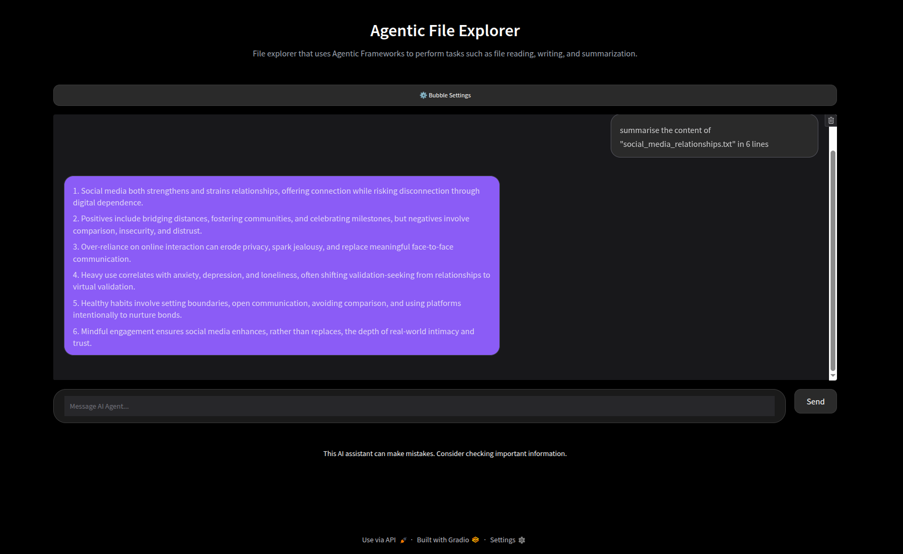

# Agentic File Explorer

File explorer that uses an [Agent](https://docs.langchain.com/oss/python/langchain/agents#example-of-react-loop) to perform tasks such as file reading, writing, and summarization.  
Check out the [Langchain Docs](https://docs.langchain.com/) to understand the tools used through out the project.  
Check out the [Gradio Docs](https://www.gradio.app/docs) to familiarise yourself with Gradio to understand the tools used for the UI.

## Getting Started

#### Set up Llama

```
ollama pull qwen3:8b
```

#### Install [UV](https://docs.astral.sh/uv/getting-started/installation/) using one of the commands below

```
curl -LsSf https://astral.sh/uv/install.sh | sh # curl
wget -qO- https://astral.sh/uv/install.sh | sh # wget
```

#### Set up Environment (create environment and install dependencies)

```
uv sync
```

#### Run the agent

```
uv run main.py
```

#### Flags

| Flag          | Default  | Description                                | Example           |
| ------------- | -------- | ------------------------------------------ | ----------------- |
| --model       | qwen3:8b | The model used for the flow                | --model qwen3:8b  |
| --verbose     | True     | Enable logging to agentic-fe.logs          | --verbose         |
| --username    | User     | Name of user during flow                   | --username me     |
| --temperature | 0        | Temperature of the model used for the flow | --temperature 0.4 |

Example usage with flags

```
uv run main.py --model llama3.1 # change the model
uv run main.py --verbose # allow logging
uv run main.py --username me # change the user's name
uv run main.py --temperature 0.4 # change the temperature of the model
uv run main.py --model llama3.1 --verbose --username me --temperature 0.4 # change everything from the defaults
```

#### Tools

| Flag                   | Description                                                                                | Supports       |
| ---------------------- | ------------------------------------------------------------------------------------------ | -------------- |
| Read                   | Read the content of a specified file.                                                      | txt, csv files |
| Write                  | Write content to a specified file (overrides previous content too)                         | txt, csv files |
| Append                 | Append content to a new line in a specified file                                           | txt, csv files |
| Clear                  | Clear the content of a specified file (can be enabled manually in basic_file_functions.py) | txt, csv files |
| List Directory Content | Get the immediate files and sub directories of a specified directory                       |                |
| Create Directory       | Create a specified directory                                                               |                |
| BFS for File System    | BFS strategy for searching directories                                                     | File search    |
| DFS for File System    | DFS strategy for searching directories                                                     | File search    |

#### Notes

- Some supported LLMs are qwen3:8b, llama3.1, phi3.5 from [Ollama](https://ollama.com/library)
- qwen3:8b has the best performance of the three, in terms of experimentation so far.
- Check out some other [integration packages](https://docs.langchain.com/oss/python/integrations/providers/overview).
- Be explicit when telling the agent to search. Try key words like "deep" vs "shallow" when trying to do a deep search (so the simple list directory content is not used). Or explicitly state the strategy (incase you are trying to do a BFS over DFS or vice versa).
- BFS and DFS strategies also support approximate searches as well as exact searches for file and directory names.

## User Interface (UI)

#### Run the UI

```
uv run ui.py
```

#### Run the UI (with reload)

```
gradio ui.py
```

#### Have a look at the Agentic File Explorer UI



## Unit Testing

```
uv run python -m unittest discover -s tests
```

## Auxiliary (probably not needed)

#### Capture Dependencies

```
uv lock
```

#### Create Virtual Environment

```
uv venv --python /home/andi/.local/bin/python3.12
```

#### Activate Virtual Environment

```
source .venv/bin/activate
```

#### Run scripts

```
uv run <file name>.py
```

#### Deactivate Virtual Environment

```
deactivate
```
